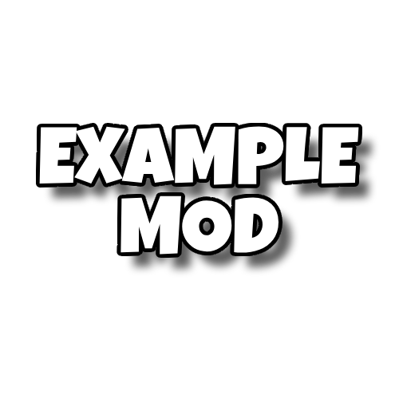

<h1 align="center">Example Mod</h1>

Example Mod Made For my Youtube Series How to Make a BTD6 Mod. 

### Downloads
<h1 aling="left"></h1>

## Episodes
Episode 1: [How to Make a BTD6 Mod and Tower](https://www.youtube.com/watch?v=G09bGRxPaNg)

Episode 2: [How to Make a BTD6 Modded Upgrade](https://youtu.be/XngAF-21l4c)

Episode 3: [Mutlishot and Custom Behaviors](https://www.youtube.com/watch?v=BaL0LK_-g00)

Episode 4: [Mod Customization](https://www.youtube.com/watch?v=Q9WmaHbzJns)

Episode 5: [Changing Textures in Your Mod](https://youtu.be/CWKokuRz8Tg?si=EsWimSZ9viAZ74cs)

Episode 6: [Publishing Your Mod](https://youtu.be/KY9iS3Jrkbs?si=p8xDJ79QcbqGh6vg)

Episode 7: [Custom Bloon, Round set & Game Mode](https://youtu.be/wP6sQZkOJv8)

Episode 8: [Paths++](https://youtu.be/TvQo3E6Shp4?si=11oXDRlwRNu7G8h)

Episode 9: [Custom Models & Animations](https://youtu.be/x_s1-GuHlSQ?si=pTqSiYZH1IW8oIL2)

Episode 10: [Harmony Patches](https://youtu.be/GtBsijbfOvQ)

Episode 11: [UI Part 1](https://youtu.be/8oMlZi8phiM?si=yeSfUBpybYMDAktk)

Episode 12: [UI Part 2](https://youtu.be/tMy-_JhKes4?si=F9IKJ55cFvB2AN8e)

Episode 13: [Changing Vanilla Bloon Displays and Custom Moab](https://youtu.be/rqYJv55ji60)

Episode 14: [Saving Mod Data](https://youtu.be/La5xuNZXSds)

## Planned Topics
All of the topics that haven't been covered

Extracting the Game's Textures

Towers P2

